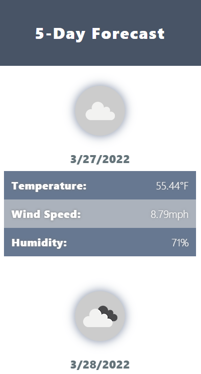

# My Weather Dashboard (Version 1.0.0)

Welcome to **My Weather Dashboard**! This app allows you to search for a city with state and country abbreviations to find the current weather and a 5-day forecast for that location.

**Click on the link or the image below to get started!**

## **Getting Started**

Getting started is simple. Just click on the search field and enter any valid city name and abbreviated state name. For example, if I wanted to get the weather in Raleigh, North Carolina, I would search `Raleigh, NC`.

## **Search Behaviors**

* Non-case-sensitive (Capitalization doesn't matter)
* Country defaults to US if none is specified
* Search algorithm looks for other countries if it can't find a match in the specified country
* Search must be entered in the format `City, State, Country*` or it will return `invalid`
    - ***Country** is an optional search parameter
* Whitespace is ignored and spaces are allowed in search fields (ex: `Chapel Hill, NC` is a valid search query)
* Search queries are saved to a maximum of 10 records

## **Other Behaviors**

* **5-Day Forecast**

    - As previously mentioned, My Weather Dashboard also gives you the 5-day forecast of a given location! The layout will look something like this:

* **Mobile First!**

    - My Weather Dashboard was designed with mobile-first in mind! This means you can easily access and use this application from any device with ease. Here's an example:

## **Technologies Used**

My Weather Dashboard is made mostly from scratch, but it was made much easier with the help of [**jQuery**](https://jquery.com/), [**Google Fonts API**](https://fonts.google.com/), and of course, the [**openweathermap API**](https://openweathermap.org/api) that made all of this possible!

## **Bugs**

* No known bugs (as of 03/26/2022)

## **Contact Me**

Have any suggestions, questions, or issues about the app? Feel free to contact me by email at: williamjosephhorn@gmail.com. 

You can also find my contact info at the bottom of the website!

